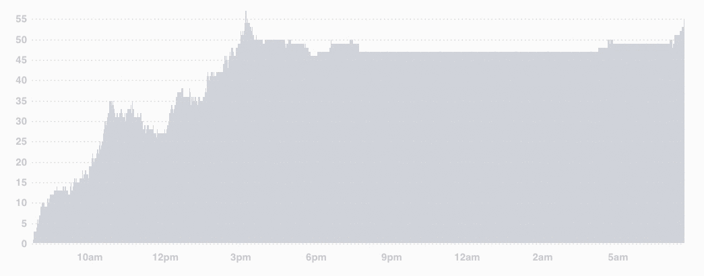

# Count Graph Chart
A graph of counts over time for a given space.

## Properties
- `data`: An array of `{count: <count at a given time>, timestamp: <iso 8601 timestamp>}` objects.
  Example: `[{"count": 4, "timestamp": "2017-03-28T12:00:00.000Z"}, {"count": 3, "timestamp": "2017-03-28T12:01:00.000Z"}]`

- `resets`: *(optional)* An array of `{count: <count to reset to>, timestamp: <iso 8601 timestamp when the reset occured>}` objects. Defaults to `[]`.
  Example: `[{"count": 4, "timestamp": "2017-03-28T12:00:00.000Z"}, {"count": 3, "timestamp": "2017-03-28T12:01:00.000Z"}]`

- `start` *(optional)* A [moment](momentjs.com) that will be used as the starting point of the
  graph. If omitted, the graph will fit its data.

- `end` *(optional)* A [moment](momentjs.com) that will be used as the ending point of the
  graph. If omitted, the graph will fit its data.
