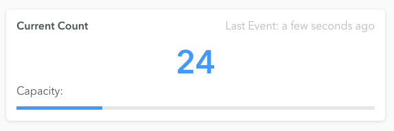

# Current Count
A chart for showing the current count of a space, and how full that space is expected to be.



# Using this chart
This chart has a single default export. This exported function takes two arguments: a dom element,
and an object full of properties. When called, this chart will render the chart inside the given DOM
element. See the below example.

```javascript
import currentCount from '@density/chart-current-count';
// or: const currentCount = require('@density/chart-current-count').default;

const element = document.getElementById('chart-container');
const props = {currentCount: 43};
currentCount(element, props);
```

In addition, if you'd like to render a chart in a context where the DOM is abstracted away from you,
such as a React or Angular app, then check out [our companion helper library](https://github.com/DensityCo/charts#hold-on-then-how-do-i-render-my-chart-in-my-react-app).

## Properties
- `currentCount`: An integer representing the current count in a space.

- `label`: *(optional)* An optional label to add to the upper left corner of the card.

- `capacity`: *(optional)* An optional integer representing the maximum capacity of the space. If
  unspecified, hide capacity card features.

# How this chart is structured
```
.
├── index.js        # Contains main chart code. Other javascript files may be present.
├── package.json
├── story.js        # Contains a react-storyboard story. Use it to present different states of your chart in the parent project.
└── styles.scss     # Contains all chart styles.
```
