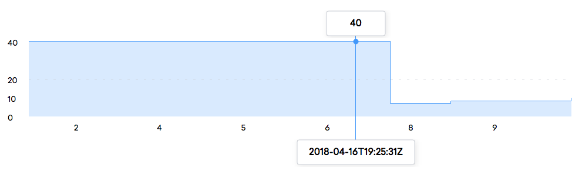
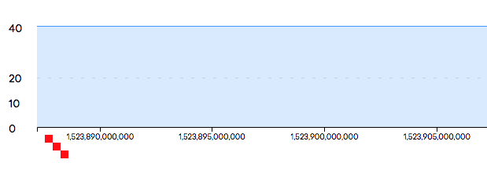
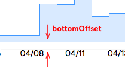
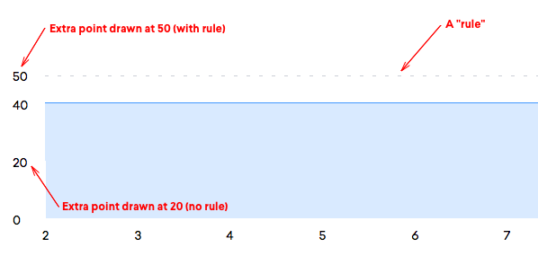
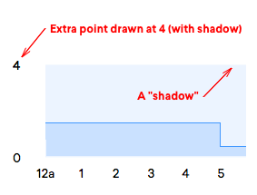
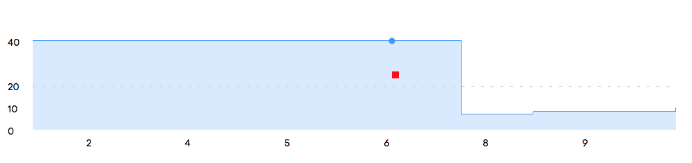
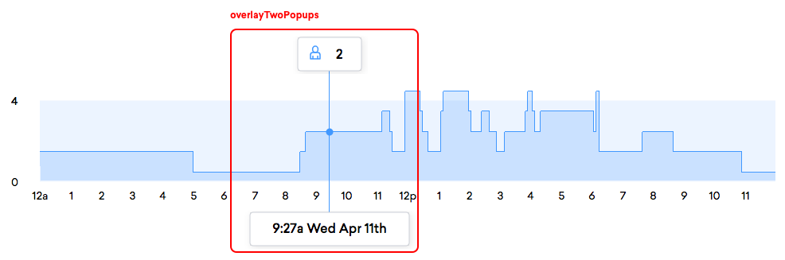
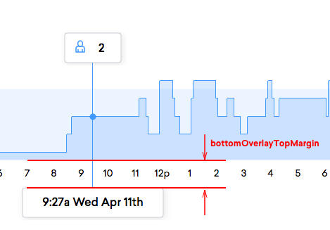
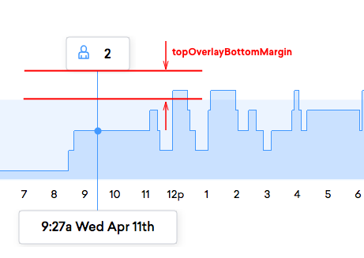
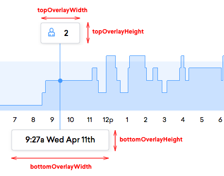

# Line Chart
Chart for displaying information using lines on a 2d grid where the bottom axis is time [npm](https://npmjs.com/@density/chart-line-chart)



## Using this chart
This chart has a single default export. This exported function takes two arguments: a dom element,
and an object full of properties. When called, this chart will render the chart inside the given DOM
element. See the below example.

```javascript
import lineChart from '@density/chart-line-chart';
// or: const lineChart = require('@density/chart-line-chart').default;

const element = document.getElementById('chart-container');
const props = {
  xAxis: exampleAxis({
    prop1: 'value',
    prop2: 'value',
  }),
  yAxis: exampleAxis({
    prop1: 'value',
    prop2: 'value',
  }),

  /* TODO: enter all props here */
};

// Make your chart
const updateData = lineChart(element);

// Give it new data
updateData(props);
```

## Examples

Take a look at the [story](./story.js) for a number of example charts.

## Helper library

In addition, if you'd like to render a chart in a context where the DOM is abstracted away from you,
such as a React or Angular app, then check out [our companion helper library](https://github.com/DensityCo/charts#hold-on-then-how-do-i-render-my-chart-in-my-react-app).

## How this chart is structured
```
.
├── index.js        # Contains main chart code. Other javascript files may be present.
├── package.json
├── story.js        # Contains a react-storyboard story. Use it to present different states of your chart in the parent project.
└── styles.scss     # Contains all chart styles.
```

# Chart subcomponents

The line chart accepts a number of different modules to control how different core chart components
are rendered. Currently, there are two types of modules that this chart knows how to work with:
`Axes` and `Overlays`.

## Axis
An `Axis` contains all the code required to render either the x or y axis on the chart. Each axis
is a function that returns a second, closed over function--very similar to a chart. The upper-level
function is called by the user so that they can pass configuration parameters to an axis, and the
lower level function is called by the chart to pass more non-user-provided configuration parameters
and an element to render the axis within. Effectively, an axis looks like this:

```jsx
export function exampleAxis({color}) {
  color = color || 'royalblue';
  return ({scale}, element) => {
    // Add an axis:
    element.call(d3.axisBottom(scale));

    // Do some custom drawing:
    const selection = element.selectAll('rect').data([10, 20, 30]);
    selection.enter()
      .append('rect')
        .attr('width', 10)
        .attr('height', 10)
        .attr('fill', color)
    .merge(selection)
      .attr('x', d => d)
      .attr('y', d => d)
    selection.exit().remove()
  };
}

// Axis Usage
const lineChart = LineChart(document.body);
lineChart({
  xAxis: exampleAxis({color: 'red'}),
});
```



### Implemented Axes

#### `exampleAxis`
The above demo axis is implemented in this package too - `import { exampleAxis } from '@density/chart-line-chart/axes';`

<br />
<br />

#### `xAxisDailyTick`
This axis renders a time-based x axis using the builtin `d3.axisBottom`. After rendering, it's
styled to match the density aesthetic - a 14px font, in Sailec, and in `grayCinder`.

`import { xAxisDailyTick } from '@density/chart-line-chart/axes';`

##### Props
- `formatter: (Number) => String` *(optional)* - A mapping function that accepts the epoch
  millisecond utc timestamp and returns the axis label for that timestamp.

- `bottomOffset: Number` *(optional)* - The distance between the axis and the bottom of the chart graph. Defaults to `15px`.



- Pick one of the two below to generate the tick values show on the axis:
  - `tickResolutionInMs: Number` *(optional)* - Specify a number of milliseconds of distance to put
    between each tick value.

  - `tickValues: Array` *(optional)* - A list of values that can optionally be passed to explicitly
    define the location of ticks on the axis. This is passed to the `.tickValues` method on the
    `d3.axisBottom`, and will be mapped through the `formatter` function if specified.

  - If neither of the above are passed, `tickResolutionInMs` is used with its default of 1 hour between ticks.

<br />
<br />

#### `yAxisMinMax`
This axis renders a y axis with by default two ticks - one at the maximum value and one at the
minimum value. It can be customized to add ticks at arbitrary points, and to style those ticks in a
number of ways.

`import { yAxisMinMax } from '@density/chart-line-chart/axes';`

##### Props
- `formatter: ({value, hasRule}) => String` *(optional)* - A mapping function that accepts a point
  to render and returns the string value to render for that given point. Defaults to `d => d.value.toString()`.

- `leftOffset: Number` *(optional)* - The distance between the axis and the left of the chart graph. Defaults to `20px`.


- `showMaximumPoint: Boolean` *(optional)* - Should the minimum point on the axis be rendered? Defaults to `false`.
- `showMaximumPoint: Boolean` *(optional)* - Should the maximum point on the axis be rendered? Defaults to `false`.

- `points: [{value: Number, hasRule: Boolean, hasShadow: Boolean}]` - A number of additional points
  to render on the axis. Each `value` is the location on the axis to draw that point, each
  `hasRule` flag indicates if a dotted rule should be drawn across the chart at the location of the
  point, and the `hasShadow` flag determines if a shadow should be drawn below a line.




- `axisRuleLineDashWidth: Number` - The width in pixels of each rule dash. Defaults to `4`.
- `axisRuleLineDashSpacing: Number` - The distance in pixels between each rule dash. Defaults to `10`.

<br />
<br />
<br />
<br />
<br />

## Overlay
An overlay is any sort of element that appears on top of the chart when the user hovers over the
chart. In a similar fashion to an axis, an overlay presents itself in the form of a function that is
called by the user with configuration parameters. However, overlays are much more managed than axes - they
are called as part a data join. Therefore, an overlay is expected to return an object from
its top-level function that contains three subkeys: `enter`, `merge`, and `exit`. Each is similar to
the nested-function inside of an axis: it takes a number of chart-specific configuration values and an
selection to render within. Each function is called in its respective life cycle step: `enter` when
a new overlay is drawn, `merge` when the overlay should be updated, and `exit` when the overlay
should be removed.

Here's a basic example:

```javascript
function overlayExample({color}) {
  return {
    enter: (data, selection) => {
      selection.append('rect')
        .attr('width', 10)
        .attr('height', 10)
        .attr('fill', color)
    },
    merge: ({mouseX, mouseY}, selection) => {
      selection.select('rect')
      .attr('x', mouseX)
      .attr('y', mouseY)
    },
    exit: (props, selection) => {
      selection.remove()
    },
  };
}

// Overlay Usage
const lineChart = LineChart(document.body);
lineChart({
  overlays: [
    overlayExample({ color: 'red' }),
  ],
});
```



### Implemented Overlays

#### `overlayTwoPopups`
This overlay renders a small popup with a drop shadow above and below the chart when the user hovers
over the chart on a system with a mouse or touches the chart on a system with a touchscreen.

`import { overlayTwoPopups } from '@density/chart-line-chart/overlays';`



##### Props
- `topPopupFormatter: {enter: (config, selection) => any, merge: (config, selection) => any, exit: (config, selection) => any}` *(optional)*

A set of three functions that collectively describe the formatting of content of the the upper overlay popup,
inspired by a d3 data join.

When the popup is rendered for the first time, `enter` is called with a d3 selection - within this
selection, you have access to modify the DOM with `d3` and can set up the structure required for
your overlay to function. This is only called once.

When the overlay needs to be re-rendered (due to a mouse movement, for example), `merge` is called.
Just like `enter`, it's passed a d3 selection, but in addition it's also passed a number of
configuration parameters (these are values that may be helpful in drawing the overlay contents, such
as the overlay width and height, the data item that is currently hovered-over, the mouse position,
etc... A complete list is below.). It's `merge`'s job to take the content rendered by `enter` and
update the dom to reflect the new data in the configuration parameters.

Finally, when the mouse cursor is moved out of the bounds of the chart, the `exit` function is
called - this function should clean up any resources or dom elements that the top overlay has
created in `enter` or `merge`.

Here's a simple example of a formatter that could be passed to `topPopupFormatter`. This formatter
renders a plain text label on the upper popup that indicates the current y value that is being
hovered over:
```javascript
{
  enter: selection => {
    // Create a new `text` node to render the label within
    selection.append('text')
      .attr('text-anchor', 'middle')
      .attr('font-weight', '500')
  },
  merge: ({topOverlayWidth, item}, selection) => {
    // Update the node to contain the value of the currently hovered-over item
    selection.select('text')
      .attr('transform', `translate(${topOverlayWidth / 2},26)`)
      .text(item.value);
  },
  // Remove all nodes within the selection
  exit: selection => selection.remove(),
}
```

There are a few stock formatters:
```javascript
/*
 * `overlayTwoPopupsPlainTextFormatter`: renders the given value centered within the overlay. Accepts
 * a function to map the `config` argument passed to the value to render on the overlay, and the
 * string `top` or `bottom` to pick which overlay's width to use for centering purposes.
 */

// For example:
import { overlayTwoPopupsPlainTextFormatter } from '@density/chart-line-chart/overlays';
const formatter = overlayTwoPopupsPlainTextFormatter( ({item}) => `${item.value}`, 'top' );
// Now use `formatter` as the value for `topPopupFormatter` or `bottomPopupFormatter`!

/*
 * `overlayTwoPopupsPersonIconTextFormatter`: renders a "person" icon and the given value within the
 * overlay. Accepts a function to map the `config` argument passed to the value to render on an
 * overlay, and the string `top` or `bottom` to pick which overlay's width to use for performing
 * icon-positioning calculations.
 */

// For example:
import { overlayTwoPopupsPersonIconTextFormatter } from '@density/chart-line-chart/overlays';
const formatter = overlayTwoPopupsPersonIconTextFormatter( ({item}) => `${item.value}`, 'top' );
// Now use `formatter` as the value for `topPopupFormatter` or `bottomPopupFormatter`!
```

------


- `bottomPopupFormatter: {enter: (config, selection) => any, merge: (config, selection) => any, exit: (config, selection) => any}` *(optional)*

A set of formatter functions that can be used to render the contents within the bottom popover. See
the above documentation for `topPopupFormatter` for an explaination of `enter`, `merge`, and `exit`.

- `bottomOverlayTopMargin: Number` - The spacing between the top of the bottom overlay and bottom of
  the chart in pixels.



- `topOverlayBottomMargin: Number` - The spacing between the bottom of the top overlay and top of
  the chart in pixels.



- `topOverlayWidth: Number` - The width of the top overlay, in pixels.
- `topOverlayHeight: Number` - The height of the top overlay, in pixels.
- `bottomOverlayWidth: Number` - The width of the bottom overlay, in pixels.
- `bottomOverlayHeight: Number` - The height of the bottom overlay, in pixels.


