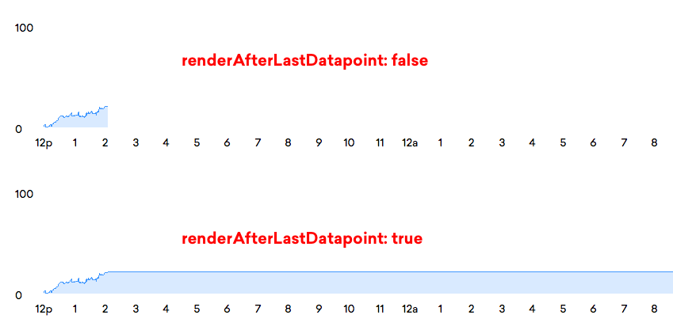
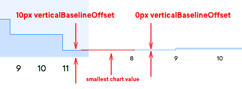
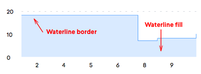
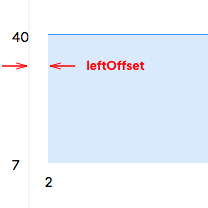

# Line Chart
Chart for displaying information using lines on a 2d grid where the bottom axis is time [npm](https://npmjs.com/@density/chart-line-chart)


## Using this chart
This chart has a single default export. This exported function takes two arguments: a dom element,
and an object full of properties. When called, this chart will render the chart inside the given DOM
element. See the below example.

```javascript
import lineChart from '@density/chart-line-chart';
// or: const lineChart = require('@density/chart-line-chart').default;

const element = document.getElementById('chart-container');
const props = {
  xAxis: exampleAxis({
    prop1: 'value',
    prop2: 'value',
  }),
  yAxis: exampleAxis({
    prop1: 'value',
    prop2: 'value',
  }),
  /* and more... see the 'chart props' section below */
};

// Make your chart
const updateData = lineChart(element);

// Give it new data
updateData(props);
```

## Examples

Take a look at the [story](./story.js) for a number of example charts.

## Helper library

In addition, if you'd like to render a chart in a context where the DOM is abstracted away from you,
such as a React or Angular app, then check out [our companion helper library](https://github.com/DensityCo/charts#hold-on-then-how-do-i-render-my-chart-in-my-react-app).

## How this chart is structured
```
.
├── index.js        # Contains main chart code. Other javascript files may be present.
├── package.json
├── story.js        # Contains a react-storyboard story. Use it to present different states of your chart in the parent project.
└── styles.scss     # Contains all chart styles.
```

# Chart props

- `xAxis: Axis` and `yAxis: Axis` - defines the horizontal and vertical axes used to render the
  chart. See [below](#Axis) for a definition of what makes an `Axis`.

- `xAxisStart: Number | String | moment` *(optional)* - The first value to use on the x axis of the
  chart. If a `Number`, it's interpreted as epoch milliseconds. If a `String`, it's parsed as an ISO
  timestamp.  And, if a moment, it's used as is for chart calculations. If unspecified, it defaults
  to the first value in the [default dataset](#datasets).

- `xAxisEnd: Number | String | moment` *(optional)* - The last value to use on the x axis of the
  chart. If a `Number`, it's interpreted as epoch milliseconds. If a `String`, it's parsed as an ISO
  timestamp.  And, if a moment, it's used as is for chart calculations. If unspecified, it defaults
  to the last value in the [default dataset](#datasets).

- `yAxisStart: Number` *(optional)* - The smallest value to render on the y axis. If unspecified, defaults to the
  smallest value in the [default dataset](#datasets).

- `yAxisEnd: Number` *(optional)* - The largest value to render on the y axis. If unspecified, defaults to the
  largest value in the [default dataset](#datasets).

- `overlayShowPoint: Boolean` *(optional)* - When the user hovers over the graph, should a point be drawn along
  the default dataset's path? Defaults to `true`.

- `overlayPointRadius: Number` *(optional)* - The radius of the point to render in pixels when the
  user hovers over the graph. This value is only used if `overlayShowPoint` is `true`. Defaults to
  `4.5`.

- `overlays: [Overlay]` *(optional)* - An array of overlays to show when the user hovers over the
  chart. See the [overlay](#overlay) documentation below to learn more about how overlays are
  rendered.

- `data: [Dataset]` - A number of datasets to render on the chart. See the below documentation on
  [datasets](#datsets) to learn more about the format of a dataset.

# Chart subcomponents

The line chart accepts a number of different modules to control how different core chart components
are rendered. Currently, there are three types of modules that this chart knows how to work with:
`Datasets`, `Axes`, and `Overlays`.

<br/>
<br/>

## Dataset

A `Dataset` is a collection of points to render on the graph and a number of associated properties
that define how that data should be rendered. A line chart can accept multiple different datasets,
potentially each with different rendering parameters.

```javascript
[
  {
    name: 'default',
    type: dataWaterline,
    data: [
      { timestamp: '2018-04-12T03:55:00.000Z', value: 0 },
      { timestamp: '2018-04-12T03:50:00.000Z', value: 3 },
      { timestamp: '2018-04-12T03:45:00.000Z', value: 1 },
      { timestamp: '2018-04-12T03:40:00.000Z', value: 5 },
    ],
  }
]
```

### Props
- `name: String` *(optional)* - An optional name to give to the dataset. This value defaults to `default`.
- `type: DatasetRenderer` *(optional)* - A function to render the dataset to the chart.
- `data: [{timestamp: String | Number | moment, value: Number}]` - A collection of data to render to
  the chart. These values are passed through the renderer (`type` property) to draw them to the
  screen. `timestamp` is interpreted as epoch milliseconds if a `Number`, ISO time if a `String`,
  and used explicitly if a `moment`.
- `renderAfterLastDatapoint: Boolean` *(optional)* - Should the data line be continued after the
  final datapoint until the end of the graph? Defaults to `false`.



- `verticalBaselineOffset: Number` *(optional)* - The number of pixels of dead space below the
  bottom-most value in the y-direction. Defaults to `0`.



### Naming datasets, and the `default` name
Each dataset rendered to the chart has a name associated with it. The special value `default` is
given to the main dataset in the chart. This dataset is then used for determining bounds of each
axis (if not specified explicitly), drawing the overlay point / any custom overlays, and in general
anything that requires data in order to function.

### Note on dataset order
Datasets must be ordered from oldest to newest. If not, the chart will throw an error.

### Dataset Renderers

A dataset renderer is a special function that takes a dataset as a first parameter, and a DOM element as
it's second parameter. Its job is to render the contents of the dataset passed to it into the DOM
within the DOM element passed to it.

```javascript
// Example Dataset Renderer
function dataExample({data}) {
  return ({xScale, yScale}, element) => {
    const selection = element.selectAll('path').data(data);
    selection.enter()
      .append('path')
    .merge(selection)
      .attr('d', d => d.reduce((acc, i) => {
        // Draw lines to each datapoint in the dataset
        return `${acc} L${xScale(moment.utc(i.timestamp).valueOf())},${yScale(i.value)}`
      }, ''));
    selection.exit().remove();
  }
}
```

### Implemented Dataset Renderers

#### `dataWaterline`
Renders a filled polygon reflecting the datapoints with a border on top. Datapoints are drawn by
first moving horizontally and then vertically, rather than drawing a line directly point-to-point.
It's called a waterline because I needed a spiffy name and it looks a bit like a low-poly wave in the
default color scheme.



##### Props
  - (requires a `data` prop, just like every dataset renderer)
  - `color: String` *(optional)* - the fill color of the polygon underneath the top border. Defaults to `rgba(65, 152, 255, 0.2)`.
  - `borderColor: String` *(optional)* - the stroke color of the top border of the waterline. Defaults to `rgb(65, 152, 255)`.

<br />
<br />
<br />
<br />
<br />

## Axis
An `Axis` contains all the code required to render either the x or y axis on the chart. Each axis
is a function that returns a second, closed over function--very similar to a chart. The upper-level
function is called by the user so that they can pass configuration parameters to an axis, and the
lower level function is called by the chart to pass more non-user-provided configuration parameters
and an element to render the axis within. Effectively, an axis looks like this:

```jsx
export function exampleAxis({color}) {
  color = color || 'royalblue';
  return ({scale}, element) => {
    // Add an axis:
    element.call(d3.axisBottom(scale));

    // Do some custom drawing:
    const selection = element.selectAll('rect').data([10, 20, 30]);
    selection.enter()
      .append('rect')
        .attr('width', 10)
        .attr('height', 10)
        .attr('fill', color)
    .merge(selection)
      .attr('x', d => d)
      .attr('y', d => d)
    selection.exit().remove()
  };
}

// Axis Usage
const lineChart = LineChart(document.body);
lineChart({
  xAxis: exampleAxis({color: 'red'}),
});
```


### Implemented Axes

#### `exampleAxis`
The above demo axis is implemented in this package too - `import { exampleAxis } from '@density/chart-line-chart/axes';`

<br />
<br />

#### `xAxisDailyTick`
This axis renders a time-based x axis using the builtin `d3.axisBottom`. After rendering, it's
styled to match the density aesthetic - a 14px font, in Sailec, and in `grayCinder`.

`import { xAxisDailyTick } from '@density/chart-line-chart/axes';`

##### Props
- `formatter: (Number) => String` *(optional)* - A mapping function that accepts the epoch
  millisecond utc timestamp and returns the axis label for that timestamp.

- `bottomOffset: Number` *(optional)* - The distance between the axis and the bottom of the chart graph. Defaults to `15px`.


- Pick one of the two below to generate the tick values show on the axis:
  - `tickResolutionInMs: Number` *(optional)* - Specify a number of milliseconds of distance to put
    between each tick value.

  - `tickValues: Array` *(optional)* - A list of values that can optionally be passed to explicitly
    define the location of ticks on the axis. This is passed to the `.tickValues` method on the
    `d3.axisBottom`, and will be mapped through the `formatter` function if specified.

  - If neither of the above are passed, `tickResolutionInMs` is used with its default of 1 hour between ticks.

<br />
<br />

#### `yAxisMinMax`
This axis renders a y axis with by default two ticks - one at the maximum value and one at the
minimum value. It can be customized to add ticks at arbitrary points, and to style those ticks in a
number of ways.

`import { yAxisMinMax } from '@density/chart-line-chart/axes';`

##### Props
- `formatter: ({value, hasRule, hasShadow}) => String` *(optional)* - A mapping function that accepts a point
  to render and returns the string value to render for that given point. Defaults to `d => d.value.toString()`.

- `leftOffset: Number` *(optional)* - The distance between the axis and the left of the chart graph. Defaults to `20px`.



- `showMaximumPoint: Boolean` *(optional)* - Should the minimum point on the axis be rendered? Defaults to `false`.
- `showMaximumPoint: Boolean` *(optional)* - Should the maximum point on the axis be rendered? Defaults to `false`.

- `points: [{value: Number, hasRule: Boolean, hasShadow: Boolean}]` - A number of additional points
  to render on the axis. Each `value` is the location on the axis to draw that point, each
  `hasRule` flag indicates if a dotted rule should be drawn across the chart at the location of the
  point, and the `hasShadow` flag determines if a shadow should be drawn below a line.


- `axisRuleLineDashWidth: Number` - The width in pixels of each rule dash. Defaults to `4`.
- `axisRuleLineDashSpacing: Number` - The distance in pixels between each rule dash. Defaults to `10`.

<br />
<br />
<br />
<br />
<br />

## Overlay
An overlay is any sort of element that appears on top of the chart when the user hovers over the
chart. In a similar fashion to an axis, an overlay presents itself in the form of a function that is
called by the user with configuration parameters. However, overlays are much more managed than axes - they
are called as part a data join. Therefore, an overlay is expected to return an object from
its top-level function that contains three subkeys: `enter`, `merge`, and `exit`. Each is similar to
the nested-function inside of an axis: it takes a number of chart-specific configuration values and an
selection to render within. Each function is called in its respective life cycle step: `enter` when
a new overlay is drawn, `merge` when the overlay should be updated, and `exit` when the overlay
should be removed.

Here's a basic example:

```javascript
function overlayExample({color}) {
  return {
    enter: (data, selection) => {
      selection.append('rect')
        .attr('width', 10)
        .attr('height', 10)
        .attr('fill', color)
    },
    merge: ({mouseX, mouseY}, selection) => {
      selection.select('rect')
      .attr('x', mouseX)
      .attr('y', mouseY)
    },
    exit: (props, selection) => {
      selection.remove()
    },
  };
}

// Overlay Usage
const lineChart = LineChart(document.body);
lineChart({
  overlays: [
    overlayExample({ color: 'red' }),
  ],
});
```


### Implemented Overlays

#### `overlayTwoPopups`
This overlay renders a small popup with a drop shadow above and below the chart when the user hovers
over the chart on a system with a mouse or touches the chart on a system with a touchscreen.

`import { overlayTwoPopups } from '@density/chart-line-chart/overlays';`


##### Props
- `topPopupFormatter: {enter: (config, selection) => any, merge: (config, selection) => any, exit: (config, selection) => any}` *(optional)*

A set of three functions that collectively describe the formatting of content of the the upper overlay popup,
inspired by a d3 data join.

When the popup is rendered for the first time, `enter` is called with a d3 selection - within this
selection, you have access to modify the DOM with `d3` and can set up the structure required for
your overlay to function. This is only called once.

When the overlay needs to be re-rendered (due to a mouse movement, for example), `merge` is called.
Just like `enter`, it's passed a d3 selection, but in addition it's also passed a number of
configuration parameters (these are values that may be helpful in drawing the overlay contents, such
as the overlay width and height, the data item that is currently hovered-over, the mouse position,
etc... A complete list is below.). It's `merge`'s job to take the content rendered by `enter` and
update the dom to reflect the new data in the configuration parameters.

Finally, when the mouse cursor is moved out of the bounds of the chart, the `exit` function is
called - this function should clean up any resources or dom elements that the top overlay has
created in `enter` or `merge`.

Here's a simple example of a formatter that could be passed to `topPopupFormatter`. This formatter
renders a plain text label on the upper popup that indicates the current y value that is being
hovered over:
```javascript
{
  enter: selection => {
    // Create a new `text` node to render the label within
    selection.append('text')
      .attr('text-anchor', 'middle')
      .attr('font-weight', '500')
  },
  merge: ({topOverlayWidth, item}, selection) => {
    // Update the node to contain the value of the currently hovered-over item
    selection.select('text')
      .attr('transform', `translate(${topOverlayWidth / 2},26)`)
      .text(item.value);
  },
  // Remove all nodes within the selection
  exit: selection => selection.remove(),
}
```

There are a few stock formatters:
```javascript
/*
 * `overlayTwoPopupsPlainTextFormatter`: renders the given value centered within the overlay. Accepts
 * a function to map the `config` argument passed to the value to render on the overlay, and the
 * string `top` or `bottom` to pick which overlay's width to use for centering purposes.
 */

// For example:
import { overlayTwoPopupsPlainTextFormatter } from '@density/chart-line-chart/overlays';
const formatter = overlayTwoPopupsPlainTextFormatter( ({item}) => `${item.value}`, 'top' );
// Now use `formatter` as the value for `topPopupFormatter` or `bottomPopupFormatter`!

/*
 * `overlayTwoPopupsPersonIconTextFormatter`: renders a "person" icon and the given value within the
 * overlay. Accepts a function to map the `config` argument passed to the value to render on an
 * overlay, and the string `top` or `bottom` to pick which overlay's width to use for performing
 * icon-positioning calculations.
 */

// For example:
import { overlayTwoPopupsPersonIconTextFormatter } from '@density/chart-line-chart/overlays';
const formatter = overlayTwoPopupsPersonIconTextFormatter( ({item}) => `${item.value}`, 'top' );
// Now use `formatter` as the value for `topPopupFormatter` or `bottomPopupFormatter`!
```

------


- `bottomPopupFormatter: {enter: (config, selection) => any, merge: (config, selection) => any, exit: (config, selection) => any}` *(optional)*

A set of formatter functions that can be used to render the contents within the bottom popover. See
the above documentation for `topPopupFormatter` for an explaination of `enter`, `merge`, and `exit`.

- `bottomOverlayTopMargin: Number` - The spacing between the top of the bottom overlay and bottom of
  the chart in pixels.


- `topOverlayBottomMargin: Number` - The spacing between the bottom of the top overlay and top of
  the chart in pixels.


- `topOverlayWidth: Number` - The width of the top overlay, in pixels.
- `topOverlayHeight: Number` - The height of the top overlay, in pixels.
- `bottomOverlayWidth: Number` - The width of the bottom overlay, in pixels.
- `bottomOverlayHeight: Number` - The height of the bottom overlay, in pixels.


